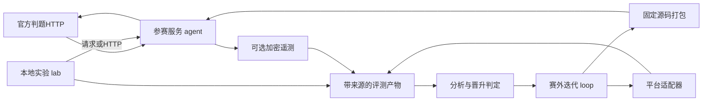

# CoreGeek 下一阶段总体架构与实现设计

> 实施更新：用户要求冻结 `main3.py`，正式脚本由平台提供，本地shell只用于测试。当前落地范围见 [v0.2实现与验证](03-v02实现与验证.md)。其余未落地条目仍为规划。
日期：2026-09-17。状态：**待实施设计**。本轮只新增设计与实施分工文档，不改策略、模拟器或提交包；下文拟定的目录、类型和命令不代表已经实现。

## 1. 目标与依据

目标是形成可提交、可追溯、可恢复、可迭代的比赛系统。在协议可靠的前提下，优化官方完整换边比赛的积分均值（胜3、平1、负0）。过程指标用于解释机制，不能替代最终胜负。生存是重要风险约束，但不把“基地存活”当成唯一优化目标。

依据按以下顺序使用：

1. [官方任务书](../../../../docs/任务书.md)、[官方接口](../../../../docs/接口文档.md)：游戏协议与已写明规则。
2. [ChatGPT策略分析](../01-游戏目标与策略分析.md)、[Loop计划](../02-Loop工程计划.md)、[日志设计](../03-日志与加密方案.md)：流程、评估和保密约束。
3. [DeepSeek策略分析](../../../DeepSeek/DeepSeekdocs/01-游戏目标与策略分析.md)、[Loop计划](../../../DeepSeek/DeepSeekdocs/02-Loop工程计划.md)、[评审台账](../../../DeepSeek/DeepSeekdocs/REVIEW.md)：反例、规则疑点和工程补充。
4. [初版报告](../../INITIAL_REPORT.md)、当前源码与模拟回放：已经实现及实测的证据。

旧文档的“缺少run.sh”“输出完整响应明文”等现状描述已被初版修复，不能重复当作当前问题。当前已有44项测试通过、3组seed完整换边模拟，但没有官方平台结果。

本设计统一旧方案中不一致的决策：

| 议题 | 本次确定的方向 |
|---|---|
| 文件划分 | 按领域与状态所有权重划，不让 `brain.py` 继续承载全部逻辑 |
| 任务记忆 | 由主进程持有显式状态，计算子进程只处理快照并返回状态提案 |
| 日志保密 | 优先采用旧ChatGPT方案中的成熟公钥封装；不生产化自行构造的对称加密参考实现 |
| 密钥与依赖不可用 | 保持关闭敏感日志；不能明文降级，也不能以“标准库零依赖”为由自造密码算法 |
| 胜负与晋升 | 官方整局结果是晋升依据；本地分数、少量半场、局部KPI不能自动晋升 |
| 样本追加 | 固定计划或预注册序贯计划；不依据“差一点显著”临时加赛 |
| 晋升效果 | 不承诺多轮成绩单调上升；允许证据不足，保留基线 |
| 打包 | 开发阶段允许标明身份的工作树快照；正式迭代采用固定commit及白名单构建 |
| 平台端点 | 未提供即明确阻断远程阶段，本地开发与模拟不受阻断 |

## 2. 当前基础与下一步缺口

| 当前实现 | 保留价值 | 下一步处理 |
|---|---|---|
| `server.py` 请求限制、计算子进程、DNS修复 | 提交服务边界已可用 | 分离HTTP、监督执行、状态提交；统计完整请求时延 |
| `protocol.py` 类型与字段解析 | 兼容官方样例 | 拆成领域类型、协议编解码、规则配置；补结构化反馈与字段来源 |
| `grid.py` 多目标BFS、预留、失败后改序 | 可复用路径算法 | 扩充路径结果、阻塞原因和规划期缓存 |
| `brain.py` 建塔、任务、升级、返防与选靶 | 已有可运行基线 | 分拆策略提案和统一调度，不让各模块直接抢写最终指令 |
| 任务摘要及回合echo | 防部分陈旧响应 | 增加任务实例、待处理调用、反馈证据和有界SOP记忆 |
| `simulate.py` 完整逐回合请求流 | 可用于回归和故障复现 | 独立裁判规则与fixture；修复比较偏差；保存规则近似清单 |
| `package.py` 确定性白名单 | 可复用构建流程 | 支持递归子包、依赖锁定、干净commit构建和内容身份 |
| `tests/` 与原版快照 | 回归基础 | 按合同、场景、HTTP、模拟、恢复拆分；保留原版快照不可改写 |

初版模拟的候选任务每半场1400分、原版2000分来自不一致的fixture流程，不能得出“真实解题更差”的结论；同样不能根据候选击杀较多直接得出整体更优。下一阶段首先修正评估依据。

## 3. 三个独立部分



- **agent**：只消费游戏观测，输出规定的三个顶层字段。无平台管理凭据，不调用开发CLI，不在代理主机执行比赛 `executeCmd`。
- **lab**：生成请求流、执行近似裁判、回放、评估和故障注入。合成任务命令只匹配受控fixture，不执行任意shell。
- **loop**：赛外管理假设、开发调用、校验、版本、打包、平台操作、预算与归档。与游戏里的LLM预算分开。

三者共享最小的数据格式约定，不共享策略决策实现。模拟器对碰撞、预算、攻击等关键规则独立实现并用官方反例验证，避免“策略和裁判调用同一个错误函数仍全绿”。

## 4. 建议目录与职责

以下为目标结构；小型职责可以先在同一文件实现，不为凑目录提前创建空抽象。

```text
main3.py / run.sh                 # 保留现有提交入口
src/agent/
  brain.py                       # 兼容 decide(payload) 的薄入口
  model.py                       # Observation/Unit/Feedback/Decision等领域类型
  protocol.py                    # JSON解析、序列化、字段和大小约束
  rules.py                       # 已知规则、可验证假设与版本
  config.py                      # 策略参数，冻结后参与构建摘要
  server.py                      # HTTP传输、超时、容量，不含策略
  runtime.py                     # 计算子进程监督、截止时间、响应提交
  state.py                       # session/round/task状态、请求去重与版本
  engine.py                      # 单回合流程编排，唯一策略入口
  world.py                       # 地图索引、威胁、基地占地、证据来源
  navigation.py                  # 多目标路径、站位、阻塞与缓存
  scheduler.py                   # 提案仲裁、人员/金币/空间/物品预留
  guard.py                       # 最终动作约束检查与安全降级
  policies/
    defense.py                   # 返防、操炮匹配、应急撤离
    combat.py                    # 分武器弹道和联合目标选择
    economy.py                   # 采矿、卖矿、采购与升级工作计划
    construction.py              # 塔墙布局、通路验证和重建
    intelligence.py              # 新闻、宝藏证据、召唤候选（后续阶段）
  tasks/
    workflow.py                  # 任务状态机与部分答案管理
    channel.py                   # LLM/命令请求及反馈关联
    memory.py                    # 任务证据、SOP候选与复用记录
  telemetry/
    events.py                    # 结构化事件、限额和采样
    writer.py                    # 单写者sink；关闭/公钥封装
lab/
  referee.py                     # 回合结算和实体生命周期
  rules.py                       # 独立动作校验/碰撞/伤害规则
  scenarios.py                   # 场景、随机流、波次、地图profile
  task_fixtures.py                # 中立任务oracle和反馈场景
  replay.py                      # 旧请求流回放与差异报告
  evaluate.py                    # 换边、指标、时延、证据清单
loop/
  cli.py                         # 固定命令入口
  controller.py                  # 迭代状态机
  store.py                       # 状态、操作账本、锁与原子保存
  budget.py                      # 开发/平台配额、预留、结算
  artifact.py                    # commit导出、白名单打包、解包验收
  platform.py                    # DTO/能力合同；mock与真实适配器
  analysis.py                    # 证据完整性、分层指标、晋升决定
  driver.py                      # 外部开发Agent调用合同
configs/                         # 策略、lab profile、loop配置；不放凭据
schemas/                         # 类型之外的机器可读产物合同
fixtures/                        # 脱敏官方样例、任务与故障反例
opponents/legacy/                # 原版不可变快照及来源清单
scripts/                         # 轻量兼容命令，不再容纳整套裁判
runs/                            # 本地运行结果，默认不入Git
```

提交白名单只覆盖入口、`src/agent/**`、冻结配置、必要依赖和构建元数据；禁止误打包 `lab/loop/opponents/runs`。原版对手路径迁移时保持文件字节和摘要，不能顺便重构。

## 5. 核心合同与状态所有权

### 5.1 领域对象

| 对象 | 必须表达的内容 | 所有者 |
|---|---|---|
| `Observation` | 回合、双方可见单位、机器人、任务、商店、新闻、上轮反馈、原始字段引用 | protocol构造，只读 |
| `RuleProfile` | 规则版本、来源、已确认值、待确认项、保守策略；本地裁判假设另存 | rules/config |
| `WorldView` | 地图索引、合法候选站位、路径成本、威胁估计、未知值 | world/navigation，只读 |
| `SessionState` | session epoch、已处理回合、版本、最近响应、工作计划、任务状态、记忆 | 主进程state，唯一写者 |
| `Intent` | 提案ID、角色/塔、动作、互斥资源、前置条件、优先级、风险、有效期、原因码 | 各策略模块返回 |
| `Decision` | 合法Response、基于的state_version、状态增量、待确认动作、诊断事件 | engine生成，runtime提交 |
| `Evidence` | value、source、观察回合、关联ID、置信/unknown | 各分析模块，不能伪装官方字段 |

内部调用合同建议为：

```python
compute(observation, state_snapshot, rule_profile, deadline) -> Decision
propose(world, state_snapshot, policy_context) -> list[Intent]
arbitrate(intents, reservations, deadline) -> Plan
validate(plan, observation, rule_profile) -> GuardResult
```

以上是设计签名，不是当前可导入API。策略模块不能修改传入状态，不能输出HTTP，不能直接扣金币；调度器生成唯一最终计划。`guard` 无权偷偷添加另一套收益策略，只过滤非法或不满足前置条件的动作并说明原因。

### 5.2 单回合流程

1. HTTP验证大小、结构与绝对截止时间，生成规范化请求摘要。
2. Session识别、请求去重、获取状态版本；不能只用roundNo作为全局缓存键。
3. 消费能可靠关联的反馈；不确定的反馈保留 `unmatched`。
4. 构建WorldView，一次计算常用地图索引，按需计算路径和威胁。
5. 战略上下文确定本回合人员可用性、任务锁及防御风险约束。
6. 任务、经济、建造、防御产生Intent；调度器统一选择和预留。
7. 已分配操作者的炮塔由combat统一选靶；同回合伤害估计共享。
8. guard校验最终动作、顶层prompt/executeCmd关联和输出大小。
9. runtime接受同版本Decision，保存待发送响应及状态增量，再发送响应。
10. 下一观测确认动作是否生效。发送成功、返回合法、经济收益、任务完成是不同事件。

攻击在机器人移动前按当前位置规划，但伤害在回合末统一结算：预测“会击杀”可以用于减少跨塔溢出，不能在本回合威胁评估中提前移除该机器人的攻击。

### 5.3 监督进程、状态与重试

沿用初版“HTTP主进程 + 可终止计算子进程”，新增显式快照/提案协议；子进程不持有唯一任务记忆。先保留每请求spawn，只有完整HTTP p99显示启动成本成为瓶颈，再评估常驻worker，避免同时引入两种状态模型。

- 同session串行推进状态；不同session可并行。队列等待也计入截止时间。
- 同一session、回合、输入摘要的重试返回**完全相同缓存响应**，不重复推进任务、扣LLM预算或生成命令。
- 同回合不同摘要视为冲突，不合并为两次合法推进；返回完整空动作并记冲突，后续靠新观测重新同步。
- 旧回合有缓存则重放原响应，无缓存则返回空动作，不回滚当前状态。
- 新回合跳号：保存观测，取消无法可靠关联的pending调用，重新规划；不凭空补执行中间回合。
- 子进程超时/异常后拒绝其迟到结果，保留观测可确认的事实，只提交“本回合使用空响应”的记录；不能应用未发出计划的记忆更新。
- 缓存落盘与HTTP写出之间仍可能崩溃，不能声称网络exactly-once。持久化的是“计划发送”，实际效果以平台下一观测为准。

现有协议没有可信match_id/half_id。优先使用平台启动时可注入的可信标识；未提供时，一个启动实例绑定一个比赛上下文，内部epoch只是本地标识。阵营/队伍/地图变化和回合重置可提示换半场，但不能证明两场身份：歧义时清除有风险的pending任务关联并重同步，不能拼接为官方同一比赛。平台若把多个不可区分比赛并发发往同一服务，必须由部署方式隔离，客户端无法自行正确推断。

记忆分三层：回合预留不跨回合；半场战术状态按epoch隔离；已验证SOP只有在规则允许同场跨半场延续、且启动身份明确时继承。跨比赛固定知识来自版本化、允许的构建输入，不默认在线跨比赛积累数据。

持久快照是内部运行状态，不是共享日志。平台可读比赛进程的能力无法由日志加密消除；内部快照保存在受控路径，不上传、不入提交包。默认先实现进程内状态，文件检查点作为环境能力明确后的可选项，缺失时允许冷启动重同步。

### 5.4 截止时间和降级

以官方连接建立后5秒为硬边界，本地完整HTTP p99目标小于1秒。初始内部预算建议：请求接收上限0.75秒、计算最多3秒、剩余时间用于启动/清理/编码/发送；**全部共享绝对截止时间**，不能把独立超时简单相加后声称合规。启动不做反向DNS；并发上限和请求体限额延续初版并配置化。

各模块检查deadline，优先缩减候选枚举，保留已验证的低成本防御/维持计划。最终guard来不及完成时返回完整空动作。日志阻塞、模型解析失败或可选策略异常不应导致整个服务退出。HTTP与判题沙盒15秒命令时限是两回事，代理不能本机等待沙盒执行。

## 6. 策略模块设计

### 6.1 调度与资源仲裁

`ReservationTable`在本回合统一管理：角色动作槽、炮塔控制槽、下一步目标格、建设目标格、金币、背包物品、同时存活武器数量。`Intent`具有 `depends_on` 时，依赖失败一并剔除并重新释放预留，不能留半套计划。

硬约束先于收益排序：每角色至多一动作或一次操炮；塔只绑定一个角色；共享金币不得超支；不要使用尚未通过观测确认到账的出售收入；本回合购买的券默认下回合确认后使用。硬约束只描述已知规则，未知碰撞或弹道不能包装成确定违法。

长期工作计划保存目标、阶段、进展回合与失败次数，角色死亡、矿枯竭、建筑升级/损毁会使计划失效。暂时受阻不每回合彻底洗牌，连续失败则重新规划或换工作；角色ID仅作确定性平局规则，不决定固定职业。

### 6.2 地图、建设和防御

- `navigation`提供多目标最短路、第一步和总长度、不可达原因；cache只在当前观测/占用版本有效，长期缓存必须重新验证。
- `construction`联合规划塔位、操炮站位和出入口，不仅验证建筑格。加墙前检查角色到矿、商店、任务点、炮台的连通性及三塔不同操控位的匹配。
- 建造区域按任务书footprint距离兜底；样例不一致保留为待确认项，不“在线试错烧异常”学习。
- `defense`比较返防路径、威胁到达估计和安全余量，枚举最多三角色的分配；威胁估计附假设，不假定知道官方机器人AI。
- 开拓者夜间继续任务还是返防由风险门槛决定。任务收益高且两工可守则保活，威胁超过门槛可显式放弃任务并撤离；记录被放弃的证据和原因。
- 围墙、塔型配比、基地优先升级均保留为可消融策略参数，不能因当前初版默认值就视为已证最优。

### 6.3 经济与战斗

经济按“采集→批量卖出→采购→运输→使用”形成状态机；预估往返时间、当前价格、背包、返防窗口及升级回血价值。升级券按目标与券名建立在途库存，目标已被另一工升级时重新指派可用建筑，不重复采购失效库存。

战斗模块分离几何合法性、预估伤害和战略权重：

- 加特林逐对点积检查90度锥，目标数符合等级；空落点补齐作为保守兼容策略单独统计命中效率。
- 电磁炮按线段上的目标次序消耗能量，不能把每个穿透目标都记为完整伤害。
- 火箭枚举合法中心及溅射影响，等级多弹可重叠，优先使用观测cooldown。
- 统一保留跨武器预计伤害，目标仍以原观测血量参与本回合存活威胁。
- 弹道遮挡/友伤/对建筑伤害未知时走保守profile；待平台证据确认后更新规则版本及回归场景。

新闻与宝藏后置：新闻先存证据及有效日期，再提出价格/物品/坐标假设。宝藏集合不完整不得盲目献祭；召唤投入须单独评估给对手增加击杀分的可能，不和基础可靠性重构混在一轮。

## 7. 任务与自进化

建议状态机：

```text
IDLE → TRAVELLING → ACCEPT_PENDING → ACTIVE
ACTIVE → MODEL_PENDING → COMMAND_PENDING → ACTIVE
ACTIVE → MODEL_PENDING → SUBMIT_PENDING → ACTIVE / ENDED
ACTIVE → ABANDON_PENDING → ENDED
任何阶段 → RESYNC（反馈缺失、身份歧义、跳回合）
ENDED → COOLDOWN / IDLE
```

`TaskState`保存本地实例ID、任务点、领取观测回合、任务原文摘要、期限、调用序号、待处理请求、证据摘要、已提交答案摘要和结束原因。实例ID不只取任务文本：同一道题被再次领取也必须是新实例。

每个模型请求约定回传 `task_instance_id/request_id/issued_round`，正文只能提出 `executeCmd`、`taskAnswer` 或任务证据摘要；解析失败可有限修复重问，未关联回复不得提交。command没有原生回传ID，只能在同实例存在唯一pending命令且时间连续时关联；跳号或混入其他会话则标未知并重新获取证据。

顶层prompt/executeCmd不直接占用角色动作槽，但依赖任务仍有效。默认同一任务仅一个未完成模型调用和一个命令；发命令当回合不再要求模型凭空读取其结果。提交答案当回合若无需额外证据，不重复发送同题prompt。

`lastRoundRoleActionResults=true`仅表示动作执行反馈，**不等于答案完全正确**。`phaseTask`消失也可能是离开、死亡或超时。只有能区分的官方反馈才标记verified success；通过率未下发时保持unknown。部分答案有证据即可提交，不能从金币变化直接反推确定通过率。

SOP采用数据记录：适用任务特征、操作模板、前置条件、成功证据、失败反例、版本、次数。先标candidate，验证后再提高复用优先级；任何模板都仍通过任务通道发到平台沙盒，不转换成开发主机命令。不保存密钥、无关文件或无限长全文；保留受限摘要及原证据引用，按收益/最近使用淘汰。

任务外LLM调用按130回合一天跟踪已发送/待确认预算，当前规则上限3次；任务内按当前有效状态免额度，但仍设本地调用和输出上限。知识总结若移到任务结束后执行，必须计入普通阶段额度。

## 8. 遥测与证据

统一事件包括 `decision/feedback/task/economy/combat/error/snapshot`；记录可解释原因码、资源预留、耗时和反馈，不索取或保存长篇隐式推理。全部派生指标携带 `source=observed|derived|fixture|platform`，unknown不能填0。

生产日志先保持 `disabled`，之后接入旧公钥方案的成熟库与固定版本依赖。参赛包只带公钥，私钥仅赛外工具读取。缺库、缺公钥、加密失败时丢弃并统计事件，不回退明文；密文队列必须有界，低优先级诊断可丢弃，不能阻塞响应。

每运行实例使用唯一run/session、序号与覆盖率信息；缺帧、乱序、篡改、缺尾分别报告。可解密不等于来源可信，公钥加密也不提供发送者认证；最终分析须结合可信平台队伍/构建/比赛绑定。没有可信终结信息不能保证尾部完整。

合成fixture可本地明文回放，真实比赛记录按保密配置存储。缺官方结果则无法晋升；只有日志不完整时，官方总结果可以保留在完整统计集合中，机制归因标为不完整，不能按输赢选择性剔除样本。每轮预先规定日志覆盖硬门槛和缺损处理。

## 9. 本地模拟与评测重建

### 9.1 三类测试不能混为一种成绩

| 模式 | 输入/目的 | 可得结论 |
|---|---|---|
| contract replay | 官方样例及固定边界请求 | 协议、确定性、动作约束与重试正确 |
| mechanism scenario | 轴向锥、共享预算、跨夜任务、死锁等单一机制 | 指定行为修复，没有整体胜率结论 |
| approximate match | 固定规则profile下双队完整换边 | 本地机制与稳定性、带限制的分数比较 |
| official evaluation | 固定平台构建、对手、赛制和预注册计划 | 满足完整性要求后参与正式晋升 |

### 9.2 中立任务oracle

保留原版输出格式适配，但取消“识别候选→强制执行命令、识别原版→直接给答案”。对相同题目双方享有同等可见信息、模型延迟和沙盒语义；oracle按任务难度与证据决定答案可得性，不按策略名字决定奖励。

至少两套fixture：纯推理题双方都能直接得到答案；需工具题双方必须实际产生符合fixture协议的查询/命令，才能获得证据。不支持工具的基线按同一规则失败，而不是oracle额外泄露答案。专门用于覆盖命令流程的旧fixture保留，但标 `comparison_eligible=false`，只做流程验收。

### 9.3 裁判与随机性

裁判明确阶段：观测→收集双方指令→已知先行物品/攻击→移动计划与碰撞→机器人行为→统一伤害及生命周期→任务/日结算。只把官方明确的攻击先于机器人移动、伤害统一结算作为硬事实；未规定的完整结算次序属于版本化profile，不声称已还原官方。

移动计划应覆盖角色与机器人相同目标、交换位置、移动链被阻断；不再仅分两批各自判碰撞。机器人AI、矿刷新、弹道边界有多个假设profile，输出敏感性结果，防止只适配一种贪心机器人。

随机数按地图/波次/矿区/任务分流，使用seed和事件键，避免某队多采一个矿改变另一队未来全部波次；即使同seed，动态交互导致的轨迹变化也不能冒称完全相同环境。

运行开始固定源码、规则、配置、对手、fixture版本与摘要，运行结束再核对是否被改写。回放包含状态快照摘要和最终决定，不仅有原始请求；完整HTTP压测另行测量，不能用direct decide耗时替代端到端时延。

## 10. 赛外迭代与平台适配

采用一个控制器和一个状态存储，不让多个脚本分别维护“当前迭代”。开发CLI只拿结构化任务和允许路径；它的自报测试结果由控制器重新验证。

主流程沿用旧计划：

```text
CREATED → PLANNED → EDITING → VALIDATING → COMMITTED → PACKAGED
→ UPLOAD_INTENT → UPLOADED → BUILD_PENDING
→ MATCH_INTENT → MATCH_PENDING → COLLECTING → ANALYZING
→ DECIDED → ARCHIVED
```

异常用结构化 `blocked_reason/retryable/next_action` 记录；配置未知进入BLOCKED_CONFIG，写请求结果未知进入RECONCILING，不把超时视为平台已取消。Mock平台也必须覆盖响应丢失、分页缺页、长期pending、重复恢复、预算不足。

上传/编译/开赛前先保存INTENT与费用预留，操作身份包含iteration、包摘要、实验计划及batch编号。请求失败后优先对账；平台无幂等与可查询标识时停止写入并报告未知，不自动重发。完整持久化使用单写锁、临时文件、fsync和原子替换；恢复核对状态版本与账本。

本地Loop验收可以走mock上传/编译/对战/日志，但每份收据必须 `provider=mock`，不能填写伪造的官方ID。真实平台接口、认证引用、返回业务码、编译终态、完整上下半场关系和计费缺失时禁止远程阶段。

正式晋升采用预注册主指标、固定版本对手池、完整比赛为统计单位、独立确认集合。仅3个seed属于冒烟/方向证据。报告均值差和适当区间及功效限制；区间跨零保持基线。拒绝候选时保留其分支和证据，不reset用户工作区。

## 11. 验收边界

- 协议：官方样例、畸形输入、慢请求、并发、超时、全响应字段、stdout/stderr无正文。
- 状态：重复回合、冲突输入、乱序、跳号、换边、重启、相同文本不同任务、旧子进程迟到结果。
- 策略：三塔/预算/物品预留、建造通路、角色与塔匹配、90度锥、冷却、同回合伤害、失败重规划。
- 任务：接取确认、模型格式错误、命令超时/截断、错误/部分答案、死亡/离点/超时、任务外额度、SOP反例。
- 模拟：中立oracle、联合碰撞、同seed随机流隔离、规则profile声明、历史原版不可变。
- Loop：恢复不重复产生副作用、账本未知状态、预算耗尽、业务码失败、分页缺损、官方结果unresolved。
- 产物：递归模块都被包含、依赖离线可用、无私钥/实验数据、可重复构建、解包真实HTTP验收。

这些是下一阶段应实现的测试合同，不能把初版44项测试的通过状态直接沿用到新架构。

实施顺序、模块分工与交付门槛见 [02-实施阶段与模块分工](02-实施阶段与模块分工.md)。
