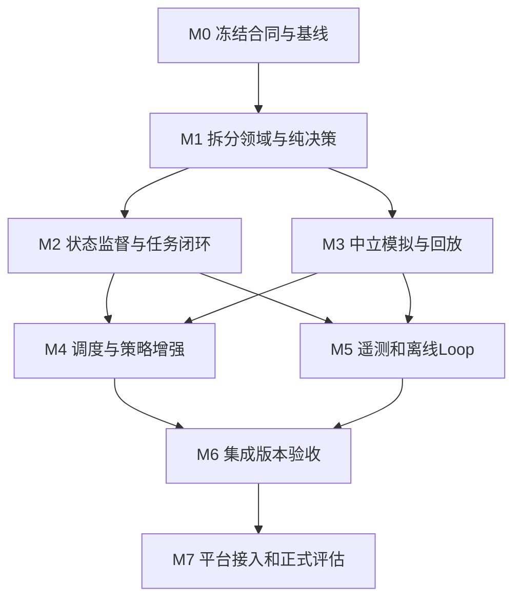

# CoreGeek 实施阶段与模块分工

> 实施更新：用户要求冻结 `main3.py`，正式脚本由平台提供，本地shell只用于测试。当前落地范围见 [v0.2实现与验证](03-v02实现与验证.md)。其余未落地条目仍为规划。
日期：2026-09-17。状态：待实施。配套 [总体设计](01-总体架构与实现设计.md)。本文件定义实现任务和责任边界，不表示本轮已启动代码重构或新的子agent任务。

## 1. 实施原则

1. 保留当前可提交初版及其原始回放，作为迁移回归基线；它不等于已经证明强于原版的正式策略基线。
2. 先冻结接口，再拆模块。每次迁移保持旧入口可运行；架构迁移与策略提升分开评估。
3. 不把全量规划一次做完。第一目标是得到“有状态、能回放、能公平比较”的v0.2，再接赛外Loop与正式平台。
4. 文件所有权按本轮工作包划定，未来可以合并或拆分。`model.py`、`engine.py`、配置schema与发布入口由集成负责人统一整合。
5. 任一阶段都可以交付可运行版本；后续可选功能失败不应破坏已经验收的基本链路。

## 2. 里程碑与依赖



M2与M3可并行。M4中不同策略可并行编码，但一次实验只启用一个主要行为变化。M5先以关闭敏感日志的方式验证控制器；加密依赖与回流通道准备好后再启用遥测。M7不阻塞M0～M6的本地工作。

| 阶段 | 交付范围 | 完成门槛 | 不通过时 |
|---|---|---|---|
| M0 基线与合同 | 归档当前初版输入身份、响应集合、版本清单；定义Observation/Intent/Decision/SessionState及schema版本 | 冻结的样例与6半场证据可重放；基线、源码、配置身份可区分；待确认规则有清单 | 只补证据和合同，不开始大拆分 |
| M1 结构迁移 | protocol/model/rules/world/navigation/engine；原brain薄封装；递归打包 | 无行为变更的部分通过既有回放逐响应一致；44项旧测试迁移有效；包内没有漏掉子目录模块 | 按模块恢复旧委托路径，保留失败差异 |
| M2 状态与任务 | 主进程state/runtime；任务实例、pending反馈、任务工作流、候选SOP | 重试不重复调用；跨半场不串状态；计算超时不污染记忆；任务命令/部分答案/结束状态有明确证据 | 关闭SOP复用，保留基本任务闭环；不能靠隐藏全局变量临时补救 |
| M3 评测纠偏 | lab独立裁判、任务oracle、联合移动、随机流、回放CLI | 工具题/纯推理题双方规则一致；不等价profile禁止比较晋升；每次运行可复现非时延结果 | 保留contract/mechanism结果，将不可靠对战指标标不可比较 |
| M4 策略增强 | 统一scheduler/guard；经济、建设、防御、combat模块 | 无双控/超支/非法锥；改动有对应反例与单变量场景；通路和生存风险不过度恶化 | 回到迁移后的稳定策略配置，保留实验分支 |
| M5 离线闭环 | Loop状态/预算/打包/mock平台/分析；有界遥测及可选公钥实现 | mock端到端可恢复；响应丢失不重复写；无敏感明文；密钥不可用时安全关闭；完整产物身份 | 仅阻断对应远程/遥测能力，本地回放继续可用 |
| M6 v0.2集成 | 固定构建、基线对照、运行手册、设计偏差记录 | 干净解压服务通过HTTP；状态/规则/故障集通过；所有分工产物使用同一合同版本 | 不发布为新稳定版本，修复具体门禁 |
| M7 平台验证 | 真实适配、运行环境/日志通道、冒烟和预注册评测 | 官方编译成功；官方完整结果可信；达预注册晋升标准 | 明确BLOCKED/INCONCLUSIVE，不把mock结果升格 |

“逐响应一致”只适用于M1声明不改变行为的迁移部分。状态修复或策略变更预期改变输出时，必须记录允许变化的场景和约束，而不是强行维持错误行为。

## 3. 工作包与模块所有权

下表可以分配给不同开发者或子agent；是职责建议，并不要求同时启动全部工作包。

| 工作包 | 负责范围 | 输入依赖 | 对外交付 | 不应修改 |
|---|---|---|---|---|
| A 合同与集成 | model/protocol/rules/config、engine、兼容入口与最终合并 | 官方规则、M0合同 | 数据模型、版本规则、集成回归、冲突裁决 | 不替其他模块暗中实现策略 |
| B 运行时与状态 | server/runtime/state、请求缓存和监督执行 | A的Observation/Decision | session与版本管理、超时/重试合同、状态故障测试 | 不在HTTP handler直接判断采矿或任务收益 |
| C 地图与调度 | world/navigation/scheduler/guard | A的模型、B的状态快照 | 可达性、Intent仲裁、资源预留、最终动作检查 | 不自行调用LLM或写平台接口 |
| D 任务与知识 | tasks/workflow/channel/memory | A合同、B pending状态、C动作槽合同 | 任务状态机、证据关联、模型输出协议、SOP候选 | 不执行主机命令、不把模型文字升级成调度权限 |
| E 防御与战斗 | policies/defense、combat | C路径/占用/角色分配 | 返防/操控Intent、分武器选靶、伤害估计及场景 | 不直接扣全队预算、不改裁判来适配策略 |
| F 经济与建设 | policies/economy、construction | C仲裁、商店观测和建筑规则 | 长期工作计划、采购升级、塔墙布局、通路检查 | 不更改任务完成的判定 |
| G 独立实验室 | lab、fixtures、原版对手清单 | 外部协议、规则来源与近似列表 | 中立oracle、独立裁判、请求流、指标和回放 | 不导入候选策略的合法性判断作为裁判 |
| H 证据与迭代 | telemetry、loop、schemas、构建发布 | B事件、G产物、A版本合同 | mock闭环、预算/幂等、可选加密、评估报告 | 不持有代理策略的唯一运行状态 |

如果可用人员/agent较少，可按四组推进：A+B为运行基础，C+E+F为调度策略，D为任务，G+H为实验与迭代。先完成共同合同，再分支开发；避免每个工作包都自行创造一套Unit或Session类型。

每个工作包的交付说明必须包含：已实现合同版本、修改路径、复现命令、测试证据、仍为unknown的规则、对其他模块的依赖。合并由集成负责人检查真实diff和测试，不以“agent说已完成”为依据。

## 4. 现有文件如何迁移

| 现有位置 | 迁移方向 | 迁移约束 |
|---|---|---|
| `main3.py` / `run.sh` | 保留，入口内部转到新runtime | 始终支持 `bash run.sh PORT`，保持0.0.0.0监听及无DNS启动 |
| `src/agent/brain.py` | 逻辑移入engine、policies、tasks；保留兼容入口 | stateless `decide(payload)`只作为单帧入口；连续对局使用显式Session或HTTP，不把单帧入口伪装为有记忆 |
| `src/agent/protocol.py` | 类型移model，数值规则移rules，保留编解码 | 先提供兼容导入再迁移测试，防一次破坏所有调用者 |
| `src/agent/grid.py` | 算法移navigation，旧路径暂时重导出 | 保留八向BFS、预留及失败重选的回归证据 |
| `src/agent/server.py` | HTTP留下，监督计算移runtime | 保留完整空响应、终止超时worker、正文不落明文日志 |
| `tools/simulate.py` | 拆入lab，原工具保留薄CLI转发 | 旧结果不改写；新格式升version；旧偏差fixture只作流程测试 |
| `tools/package.py` | 构建实现移loop/artifact，原入口转发 | 从当前单层glob改为显式递归白名单，禁止连同开发模块全目录打包 |
| `tools/baseline_agent/` | 移至opponents/legacy | 原文件字节不变，保存基础commit及逐文件hash |
| `tests/test_*.py` | 按contracts/runtime/tasks/policies/lab/loop组织 | unittest入口继续可用；测试发现不能因目录变化静默漏跑 |
| `artifacts/` | 旧结果保留，新结果使用runs/iteration/run | 不移动或覆盖历史证据到无法追溯；报告链接保持有效 |
| 旧规划文档 | 继续作为来源资料 | 不回写历史“已实现”状态，新设计与报告负责说明差异 |

## 5. 首个实现批次：建议执行范围

下一次开始写代码时，先执行M0和M1，不直接增加宝藏、召唤或复杂模型。

1. 对当前工作树生成只读基线清单及回放响应摘要；是否建立Git提交遵循实际实施授权，不混入用户其他修改。
2. 定义 `Observation/Feedback/SessionSnapshot/Intent/Decision` 和规则版本；写一组跨模块合同样例。
3. 搬移现有策略至engine/policies，先维持现有行为；现有brain与工具入口委托给新模块。
4. 将当前预算/位置预留封装为单一ReservationTable，加入操作者和物品槽检查；若产生行为变化，单独记录。
5. 更新递归打包和解压HTTP验收，确认policies/tasks目录均在产物中。
6. 完成旧测试、官方样例、固定请求流差异检查；产出M1报告及下一批明确任务。

这批暂不引入持久SOP、正式平台写接口或密码依赖，避免把结构迁移和多个高风险机制混为一次无法归因的大改动。M2状态设计虽然先冻结合同，落地仍在M1通过之后。

## 6. 后续实验队列

| 顺序 | 单一假设 | 过程指标 | 反例/失败条件 |
|---|---|---|---|
| E1 状态可靠性 | 重试/跳号/换边不会导致重复提交或旧答案串入 | 重复副作用计数、unmatched反馈、恢复结果 | 相同任务文本重领仍复用了旧pending |
| E2 任务证据闭环 | 有证据的SOP减少重复探索 | 同任务族命令次数、正确率、超时率 | 旧SOP误用导致错误答案或越权命令 |
| E3 工作计划稳定性 | 角色保留短期计划能减少反复走动 | 无进展回合、经济往返耗时 | 锁定枯竭矿或已升级建筑无法释放 |
| E4 返防调度 | 基于路径与威胁的召回减少首夜火力空窗 | 无人操炮回合、首夜受伤、任务中断 | 为全员返防过早放弃高价值任务 |
| E5 联合选靶 | 跨武器伤害预留减少过杀 | 有效伤害估计、溢出率、威胁未处理数 | 把预估死亡当本回合不再攻击，导致低估风险 |
| E6 建设布局 | 有通路约束的少量墙改善防守 | 三塔可操作率、通路、存活与资源耗用 | 墙封住工人或造成两塔争同一个站位 |
| E7 情报与主动施压 | 可验证新闻/宝藏证据带来净收益 | 证据命中、消耗失败、整局积分 | 假设未验证就消耗物品或帮对手刷击杀 |

在中立本地fixture通过只说明机制可行；正式采纳策略仍需要对应环境证据。总分比较必须注明任务模型、对手和规则profile，禁止删除不利seed后再报告平均值。

## 7. 验收产物和命令约定

目标命令约定如下，**目前尚未实现**；兼容脚本在迁移期间继续可用：

```bash
python3 -m lab.replay --input <ndjson> --profile <rules.json>
python3 -m lab.evaluate --plan <experiment.json> --output <run-dir>
python3 -m loop.cli validate --config <loop.json>
python3 -m loop.cli run --adapter mock --iteration <id>
python3 -m loop.cli resume --iteration <id>
```

每次运行应产出：输入源码/规则/config/fixture/对手摘要、实际使用的构建包摘要、state或快照摘要、测试报告、请求流、指标定义版本、已知限制、决策结论。平台样本还须有可信官方结果与双方版本；缺项显式unknown。

工作包交付的最小报告：

```text
阶段/工作包：
合同版本与上游依赖：
修改路径及对旧入口的兼容方式：
已完成行为与未完成边界：
验证命令、结果与证据路径：
与冻结基线的预期/意外差异：
规则假设与回退开关：
下一个工作包可以接入的接口：
```

## 8. 外部依赖与开放问题

| 待确认内容 | 影响范围 | 确认前如何继续 |
|---|---|---|
| 平台Python版本、子进程、文件写权限与编译要求 | runtime、依赖和打包 | 本地保持>=3.11基线，独立记录兼容假设 |
| match/half身份与进程启动生命周期 | state、跨半场记忆 | 本地epoch隔离，不冒充官方比赛ID；不支持无法区分的多场混流 |
| 上传/编译/对战/日志管理接口及计费 | loop真实适配 | mock合同、故障恢复与本地报告先完成 |
| 日志出口、来源绑定、大小限制、密码库部署 | telemetry与分析可信度 | 禁止敏感明文；保留关闭模式，不伪造完整性 |
| 弹道遮挡、重复加特林落点、友伤与PvP | combat、lab | 采用保守profile，实验假设单独版本化 |
| 单方基地毁灭、含半场平局的完整判定 | official evaluation | 读取官方结果；没有则unresolved，本地约定不能用于晋升 |
| 实际任务格式、命令环境、成功/部分正确反馈 | tasks、oracle | 多类合成fixture验证流程，真实解题能力不下结论 |

第一批实施无需等待全部外部问题解决。只在对应能力进入实际验证或远程操作时要求必要信息，避免整个项目被平台接口缺失卡住。
